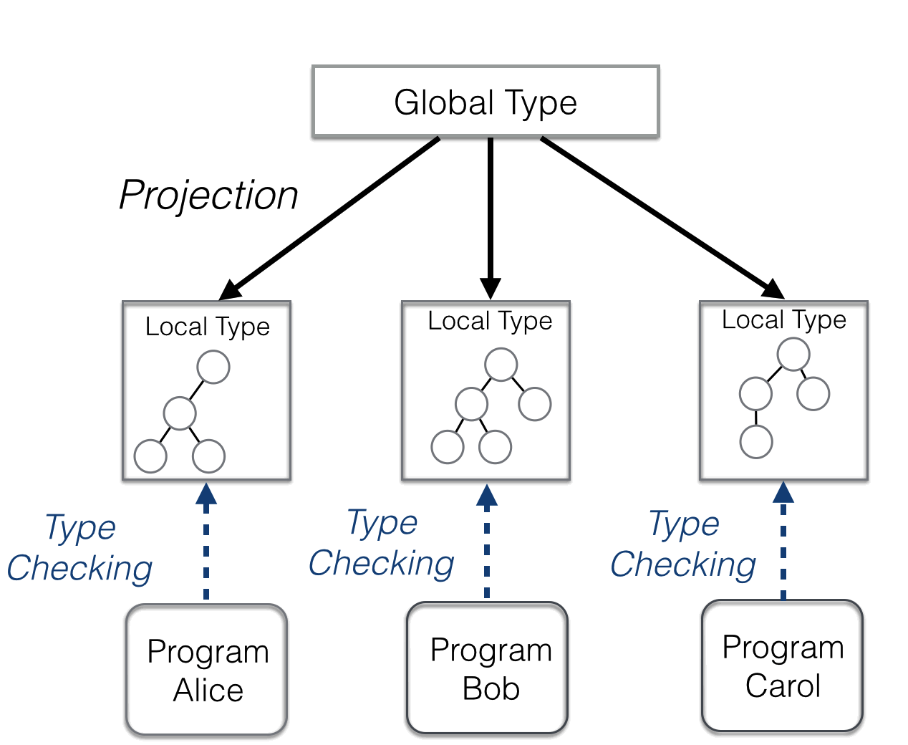
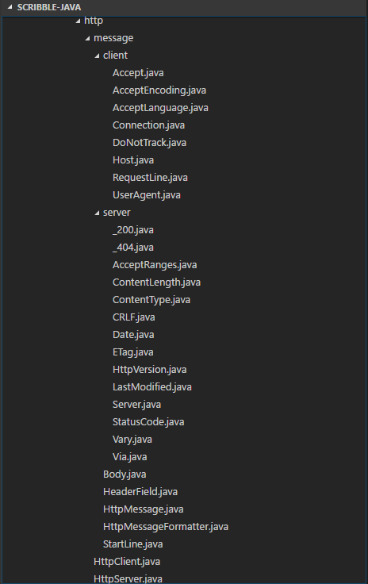
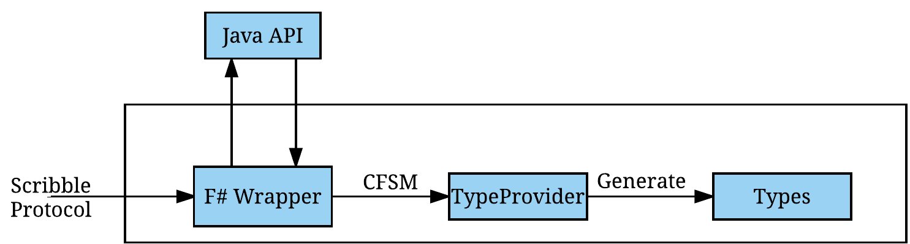
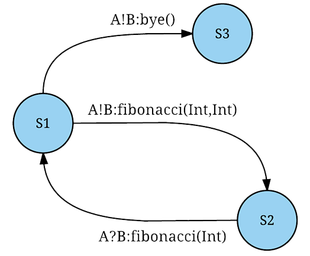
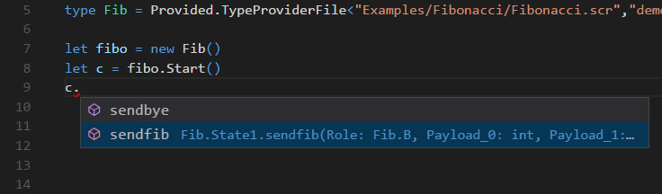
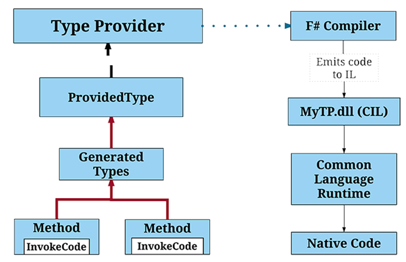
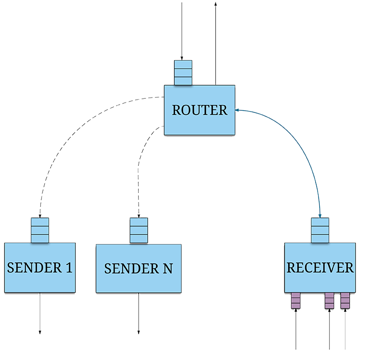
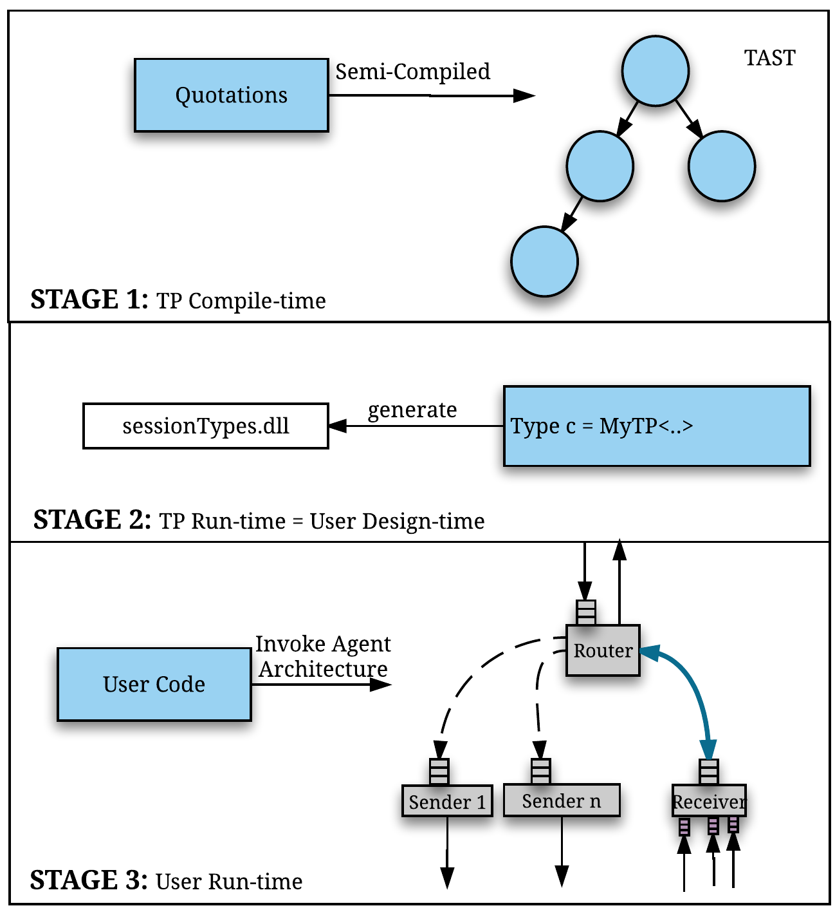
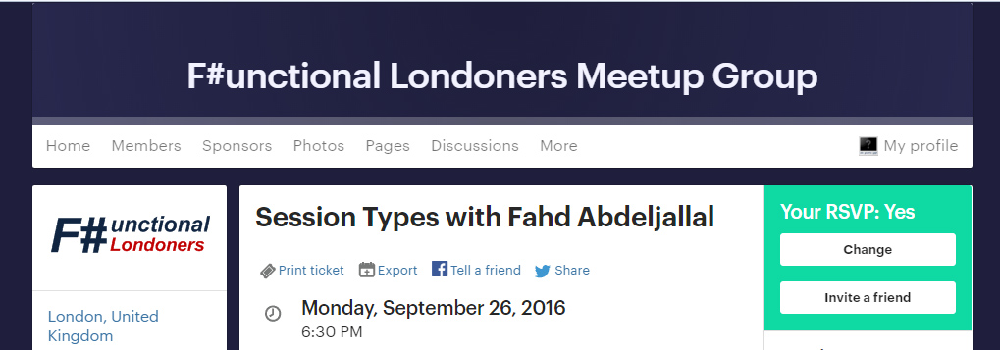

- title : Session#
- description : Session types for .Net
- author : Fahd Abdeljallal
- theme : beige 
- transition : default

## Session types for .NET

> **By** Fahd Abdeljallal

***

### Table of Contents

* [Session Types](#session)
* [Background](#generation)
    * [Code Generation](#generation)
    * [Type Provider](#provider)
* [Project contributions](#contribution)
* [Example](#fibonacci)
* [Supported features](#operator)
* [Communication model based on Actors](#communication)
* [Multi-Stage programming](#msp)
* [Case Study: Session# vs suave.io](#HTTP)
* [Conclusion](#conclusion)

***

### Session types -- Overview 

* Codify the structure of communication
* Avoid communication errors such as deadlocks, communication mismatches 

***

### Background -- Code Generation 

<!--  -->

    <ul>
    <li>The adoption of session types in
         mainstream programming languages is challenging </li>     
    <li> Hybrid session verification though endpoint API generation [FASE 2016] </li>
        <ul>
        <li> Only supported on JAVA </li>     
        </ul>
    <li> Disadvantages of code generation </li>
        <ul>
        <li> Maintanability </li>     
        <li> Increases the overall project size and complexity </li>     
        <li> The generated types can be easily tempered </li>     
        </ul>     
    </ul>

***

### Background -- Code Generation 

***

### Background -- Type Provider 

    type Test = JsonProvider<""" { "name" : "Fahd" ,"age" : "22" } """>
    let test = Test.Parse(""" { "name" : "Khalissa" , "age" : "1" } """)
    let age = test.Age // -> 1
    let name = test.Name // -> Khalissa

* Generate types into the compiler instead of providing them in the source code
* Provides types ***On-Demand***
* Using Meta-information as a schema

***

### Session# to the rescue 

> **Type safe communication library for F# and .NET** 

***

### Contributions 

- Communication library for session types
- On-demand type generation from Scribble protocols
    - 0 lines of code generated 
- Session type support on all .NET languages
- Advanced features
    - Asynchronous and Synchronous workflows
    - Multiparty session types

***

### Challenges

- Type providers are used to generate data (and not functionality)
    - We want to generate types and code
- Integration with all .NET languages.
- No Prior knowledge of
    - F# and Types providers
    - Session types and Scribble
    - Actor model 

***
### Fibonacci Example 

    [lang=yaml]
    module demo;

    type <fsharp> "System.Int32" from "Nothing" as Int;

    global protocol Fibonacci(role A, role B){
        rec Fib {
            choice at A {
                fib(Int,Int) from A to B;
                fib(Int) from B to A;
                continue Fib;
            } or {
                bye() from A to B;
            }
        }
    }

***

***

***

### Session types primitives - Send and Receive 
    

    [lang=yaml]
    fib(Int) from B to A;

     <ul>
        <li> Implementation for B </li>
    </ul>

    let c = new Provided.TypeProviderFile<"Scribble.scr",protocol,"B">() 
    
    let n = 5                            
    c.sendfib(A,n)

    <ul>
        <li> Implementation for A </li>
    </ul>

    
    let c = new Provided.TypeProviderFile<"Scribble.scr",protocol,"A">()
    
    let buf = new DomainModel.Buf<int>()       
    c.receivefib(B,buf)

***

### Session types primitives -- Selection

    [lang=yaml]
    choice at A {
        fib(Int,Int) from A to B;
        ...
    } or {
         bye() from A to B;
    }

Implementation for A

    let n = 5 , let m = 8
    match value with
        |0 -> c.sendbye(B)
        |n -> c.sendfib(B,n,m)

***

### Session types primitives -- Branching

    [lang=yaml]
    choice at A {
        fib(Int,Int) from A to B;
        ...
    } or {
         bye() from A to B;
    }

Implementation for B

    let buf1,buf2 = new DomainModel.Buf<int>()

    match c.branch() with
        | :? ByeChoice as bye -> bye.receive(A)
        | :? FibChoice as fib -> fib.receive(A,buf1,buf2)

***

### Demo-time 

***

### How is it done ?

***

### Communication Architecture 

***

### Multi-Stage Programming 

***

##### Case Study (HTTP): Session# vs suave.io  

<section>
    
    
 VS 

    
</section>

***

### Conclusion and Future work 

* An F# Library for :
    * Distributed programming
    * On-demand static generation types
    * Supporting Asynchronous + Synchronous workflows
    * Basic session types operators
    * ***.NET*** Types
* Actor Model

* Add support for Multi-thread programming
* Improve support for branching with lambdas
* Linearity at Compile-time

***
### We have been invited to give a talk

***

### Question & Answers

    type Question = TypeProvider<""" "Ask": "A question" """>
    let question = Question.Parse(""" "Ask" : "Session types rock" """)
    let response = question.Ask
***

